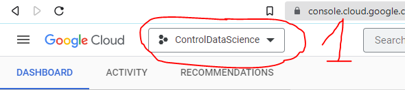

### Create a [Google Cloud Product](https://www.googleadservices.com/pagead/aclk?sa=L&ai=DChcSEwjR0PHK-bn7AhXV7lEKHZsiBUkYABACGgJ3cw&ohost=www.google.com&cid=CAESbOD2CIuxLOmfd2t_o8Y9giaWczHeAeUqNn51aRYDI5qwulQyvwJsTJh7a5hnoxfj7kF4gIk83Kip_498MV5OnksN3HN6A8t-OudBGCKqVb0SQ9_ZUzBKvn3f-9p-6eB2U4g1gupCQ2gm87oqQg&sig=AOD64_0i4FJIF4zshy7d-vnrvQ5kSHzI4g&q&adurl&ved=2ahUKEwiXxOfK-bn7AhUYXqQEHYh2CvkQ0Qx6BAgNEAE) account

For this step, you will have to put your payment information and verify your account (No, you will not be charged since google offers a 300$ credit for a free trial upon account creation). If you fail this step, close your laptop and ponder where your life is going.

After the google cloup product (GCP) account is created, 

### Create a new project 
1- Click on the three dots shown in the image below

2- Click on the gear sign to create a new project 

### Create a new [Virtual machine](https://en.wikipedia.org/wiki/Virtual_machine) or instance
Make sure the newly create project is select before creating the V

Draw inspiration from [WebPage1](https://towardsdatascience.com/running-jupyter-notebook-in-google-cloud-platform-in-15-min-61e16da34d52) and [WebPage2](https://www.datacamp.com/tutorial/google-cloud-data-science)
