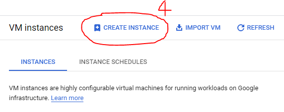
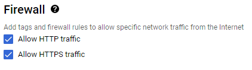

### Create a [Google Cloud Product](https://www.googleadservices.com/pagead/aclk?sa=L&ai=DChcSEwjR0PHK-bn7AhXV7lEKHZsiBUkYABACGgJ3cw&ohost=www.google.com&cid=CAESbOD2CIuxLOmfd2t_o8Y9giaWczHeAeUqNn51aRYDI5qwulQyvwJsTJh7a5hnoxfj7kF4gIk83Kip_498MV5OnksN3HN6A8t-OudBGCKqVb0SQ9_ZUzBKvn3f-9p-6eB2U4g1gupCQ2gm87oqQg&sig=AOD64_0i4FJIF4zshy7d-vnrvQ5kSHzI4g&q&adurl&ved=2ahUKEwiXxOfK-bn7AhUYXqQEHYh2CvkQ0Qx6BAgNEAE) account


> For this step, you will have to put your payment information and verify your account (No, you will not be charged since google offers a 300$ credit for a free trial upon account creation. See more about the Google Cloud Free Program [here](https://cloud.google.com/free/docs/free-cloud-features)). If you fail this step, close your laptop and ponder where your life is going.


After the google cloud product (GCP) account is created, 

### Create a new project 
1- Click on the three dots shown in the image below


2- Click on the gear sign to create a new project 


### Create a [Virtual machine](https://en.wikipedia.org/wiki/Virtual_machine) or instance
Make sure the newly create project is selected (step1 of Create a new project then select the project) before creating the instance since the latter is attached to the project. 

As described by the picture bellow

1- Clik on 1, hover over 2, and click on 3


2- Click on the + sign to create a new instance 




3 - Configure the instance
  - Name : The machine name;
  - Region, Zone: Choose the closest region to you to reduce latency;
  - Machine configuration: Select the characteristics of the machine. Note that some configuration do not support adding a gpu and might not be accessible for the selected region. Choose the machine familly accordingly.
  - Boot disk: Click on 'CHANGE' to access the type of OS (I'm using Ubuntu), the version (18.04 LTS), the boot disk type and the size (30GB)
  - Identity and API access: Make sure to Allow full access to all Cloud APIs
  - Firewall : IMPORTANT ** SELCT Allow HTTP and HTTPS Trafic**, otherwise the VM cannot be access from the internet and we NEED that acces to run Jupyter (lab and notebook) 
   
     
  - To finish click on 'CREATE' on the buttom of the page and the VM is created.


### Google's Cloud Shell
Google's Cloud Shell is a stand alone terminal in your browser from which you can access and manage your resources. To activate the shell, click  >\_ on the upper right of the console page. The shell terminal is opened at The lower part of your browser. 


This terminal runs on a f1-micro Google Compute Engine virtual machine with a Debian operating system and 5Gb storage. Note that the terminal is not persistent, meaning all the programs and packages installed in the said terminal will be delected after 20 mn of inactivity.


All the instances can be managed via the shell terminal. Here are a some  useful commands

* List all the instances ```gcloud compute instances list  ```  
* Stop the instance (might take a few seconds) ``` gcloud compute instances stop <instance name> ```
* Start the instance (might take a few seconds) ``` gcloud compute instances start <instance name>```
* Connect to the created instance (Note the instance should be running otherwise one would get an error message) ``` gcloud compute ssh <instance name> ```


### Jupyter configuration
- Generate a jupyter configuration file : ``` jupyter notebook --generate-config ```
- Create a password to access all the notebooks (**USE STRONG PASSWORD**)  ```jupyter notebook password```
- Open the configuration :  ```vim .jupyter/jupyter_notebook_config.py``` (Ubuntu) ```sudo vim .jupyter/jupyter_notebook_config.py``` (Debian)
- Add the following lines  (Switch to edit mode in vim, by typing the ```i``` character). Quit and save with the following sequence ```ESC:wq ```
  - ``` c.NotebookApp.allow_origin = '*' ```
  - ``` c.NotebookApp.ip = '0.0.0.0' ```


Draw inspiration from [WebPage1](https://towardsdatascience.com/running-jupyter-notebook-in-google-cloud-platform-in-15-min-61e16da34d52) and [WebPage2](https://www.datacamp.com/tutorial/google-cloud-data-science)
